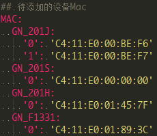
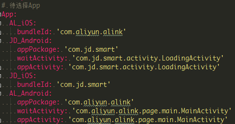
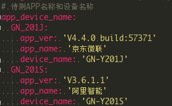
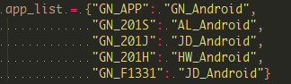
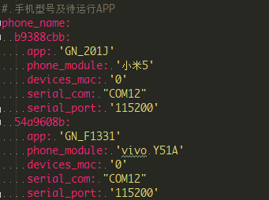
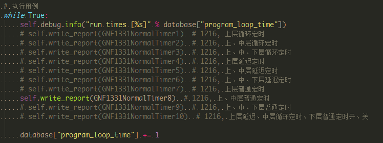
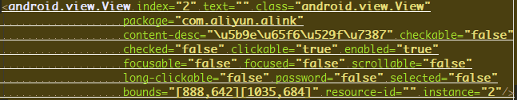
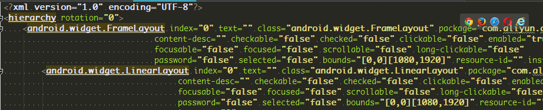
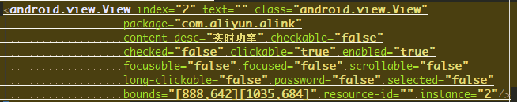

# APP自动化测试框架（基于Appium框架二次开发）


## 框架说明

基于Appium自动化测试框架，开发APP自动化测试框架，使APP自动进行测试活动。结果以Excel形式输出；

脚本可执行平台为**Windows/Mac**，支持**Android/iOS**；

支持多手机并发执行，**不限手机型号及数量**；

## Appium框架说明

> 官方文档[Introduction to Appium](https://github.com/DoctorQ/appium/blob/master/docs/en/about-appium/intro.md)

### Appium介绍

Appium是一个移动端的自动化框架，可用于测试原生应用，移动网页应用和混合型应用，且是跨平台的。可用于IOS和Android以及firefox的操作系统。原生的应用是指用android或ios的sdk编写的应用，移动网页应用是指网页应用，类似于ios中safari应用或者Chrome应用或者类浏览器的应用。混合应用是指一种包裹webview的应用,原生应用于网页内容交互性的应用。
重要的是Appium是跨平台的，何为跨平台，意思就是可以针对不同的平台用一套api来编写测试用例。

### Appium的哲学

Appium遵循下面几个原则（其实也是appium的特点）：
1. 使用自动化来测试一个app，但是不需要重新编译它
2. 写自动化case，不需要学习特定的语言
3. 一个自动化框架不需要重复造轮子
4. 一个自动化框架需要开源，在精神和实践上实现开源

### Appium的设计

为了遵循上面的原则，appium的解决方法分别如下：
第一条：采用底层驱动商提供的自动化框架。

> IOS:苹果的UIAutomation
Android 4.2+:谷歌的 UiAutomator
Android 2.3+:谷歌的Instrumentation（已被selendroid取代）

第二条：采用底层驱动商提供统一API，就是WebDriver API。

> WebDriver(也称Selenium WebDriver)其实是一个C/S架构的协议，叫做JSON Wire Protocol。通过这个协议，用任何语言写成的客户端都可以发送HTTP请求给服务器。这就意味着你可以自由选择你想要使用的测试框架和执行器，也可以将任何包含HTTP客户端的库文件加入到你的代码中。换句话说，Appium的WebDriver不是一个技术上的测试框架，而是一个自动化库。

第三条：因为WebDriver是一个非常成熟的网页协议且已经正在起草W3C的标准。我们为什么还要创造其他东西呢？相反，我们在WebDriver的基础上，扩展了一些适合移动端自动化协议的API。

第四条：你之所以能读到这篇文章，就是因为我们开源啦。

## Appium安装说明

### 目录

* [安装Appium](#安装Appium)
* [特别注意](#特别注意)

### 安装Appium

1. 安装node.js<br>
    node.js官方网站：https://nodejs.org/<br>
    > Tips:<br>
        node建议使用版本为v4.5.0，若使用最新版可能会存在错误。<br>
        node v4.5.0下载地址: https://nodejs.org/dist/v4.5.0/
    
2. 安装Appium<br>
    Appium官方网站：http://appium.io/
    > Tips:<br>
        Appium建议使用版本为v1.4.16(Windows)，v1.7.1(Mac)，建议使用最新版本。<br>
        node v4.5.0下载地址: https://nodejs.org/dist/v4.5.0/

安装教程参考：https://www.cnblogs.com/fnng/p/4540731.html

### 特别注意

1. cmd输入appium-doctor错误提示：“appium不是内部或外部命令”

    * 假设Appium安装路径为C:\Program Files (x86)\Appium<br>
    在path变量添加C:\Program Files (x86)\Appium\node_modules\.bin\\
    之后关掉cmd重新打开，再输入appium-doctor即正常。

2. 本脚本只针对真机测试，上步参考教程只需参考章节如下：

    * Appium移动自动化测试（一）--安装Appium
    * Appium移动自动化测试（二）--安装Android开发环境
    * Appium移动自动化测试（四）--one demo 
        * 第四节  安装Appium Client

## APP自动化测试框架原理说明

1. 将多部待测手机接入PC，脚本自动识别接入PC手机数量，读取手机所需信息，脚本[GetPhoneInfo_Android](./src/utils/GetPhoneInfo_Android.py)，[GetPhoneInfo_iOS](./src/utils/GetPhoneInfo_iOS.py)。

```shell
Android: adb devices -l
    # 系统版本号 #
    command = "adb -s %s shell getprop ro.build.version.release" % v["udid"]
    
    # 设备型号 #
    command = "adb -s %s shell getprop ro.product.model" % v["udid"]
    
    # 系统名称 IOS/ANDROID #
    command = "adb -s %s shell getprop net.bt.name" % v["udid"]
    
    # 设备分辨率 #
    command = "adb -s %s shell dumpsys window displays" % v["udid"]
    dpi = re.findall("init=(.+?) ", os.popen(command).read())[0].split("x")
    
iOS: idevice_id -l
    phone_index = {"iPhone7,2": {"name": "iPhone6", "dpi": [1334, 750]},
                   "iPhone8,1": {"name": "iPhone6s", "dpi": [1334, 750]},
                   "iPhone8,2": {"name": "iPhone6sPlus", "dpi": [1920, 1080]},
                   "iPhone6,1": {"name": "iPhone5s", "dpi": [1136, 640]}}
    phone_info = os.popen("ideviceinfo -u %s" % k).read()
    # 系统版本号 #
    device[k]["platformVersion"] = re.findall("ProductVersion: (.+)", phone_info)[0]
    
    # 设备型号 #
    device_name = re.findall("ProductType: (.+)", phone_info)[0]
    device[k]["model"] = device[k]["deviceName"] = phone_index[device_name]["name"]
    
    # 系统名称 IOS/ANDROID #
    device[k]["platformName"] = "iOS"
    
    # 设备分辨率 #
    device[k]["dpi"]['height'] = phone_index[device_name]["dpi"][0]
    device[k]["dpi"]['width'] = phone_index[device_name]["dpi"][1]
```

2. 根据手机数量拉起对应数量进程，1部手机对应2个进程，一进程负责启动、检测、重启Appium服务[LaunchAppiumServices](./src/common/LaunchAppiumServices.py)。另一进程负责测试用例的执行[WaitCase](./src/testcase/WaitCase.py)。

3. 依次执行测试用例，用例执行结束输出测试结果，输出目录./report/xls_report/*启动测试日期时间*/

## APP自动化测试框架使用说明

1. 启动测试前需对[配置文件](./config/Conf.yaml)进行修改，包括待测设备、APP、手机。
    * 待测设备
        * 指定待测设备，获取该设备Mac地址，该Mac地址不在配置文件中则按照指定格式添加进配置文件中。<br>
            * 参数含义：<br>
                1. GN_201J： 设备型号，全大写<br>
                2. '0'： 该型号下设备编号,可自定义，与“手机”项'phone_name'对应手机'device_mac'对应即可。<br>
                
            
            
    * APP
        * 支持APP列表，需测试APP不在列表中则按照指定格式添加新APP的相关信息至配置文件中。<br>
            * 参数含义：<br>
                1. *_iOS：iOS版APP
                2. *_Android：Android版APP
                
            <br>
            
        * 测试APP的版本和名称，内容体现在测试结果Excel表格中。<br>
        
            <br>
            
    * 手机
        * 选定和测试设备Mac搭配的测试手机，一部手机建议测试一个设备。<br>
            * 参数含义：<br>
                1. b9388cbb：手机UDID，获取命令adb devices -l<br>
                2. app：待测设备型号，自动匹配设备对应APP<br>
                <br>
                3. devices_mac：待测设备Mac编号，与“待测设备”项设备型号对应<br>
                4. serial_*：设备串口相关信息，获取设备接入PC的com口及波特率，手动修改配置<br>
                
            <br>
            
2. 修改配置文件完毕，选择待测用例。

    <br>

3. 运行[Main.py](./Main.py)，开始自动化测试活动。初始框架为死循环*While True*，自行修改测试次数。


## test调试文件夹

### [change_name.py](./test/page_source/change_name.py)
将Unicode显示格式转换成中文显示
* 使用driver.page_source命令，得到APP页面源码，源码中文部分都是Unicode格式显示，可读性差。

    <br>

* 将源码拷贝至[page.html](./test/page_source/page.html)，使用代码编辑工具(*pycharm*等)格式化代码，使代码有层级关系。

    <br>
    
* 运行[change_name.py](./test/page_source/change_name.py)，page.html文件中Unicode中文格式会变成中文显示。

    <br>
    
### [CaseDebug.py](./test/CaseDebug.py)
使用交互式解释器(*ipython*等)调试框架代码
* 对代码进行调整后再次运行需要重启Appium服务，耗时长，提炼框架关键代码，组成调试工具。 
    ```
    class WidgetTest(WidgetOperation):  // 初始化
    ```
    ```
    class b(WidgetTest):  // 用例代码复制
    ```
    ```
    class fix(WidgetTest):
        pass

    WidgetTest = fix  // 利用继承关系修改函数内容
    ```
